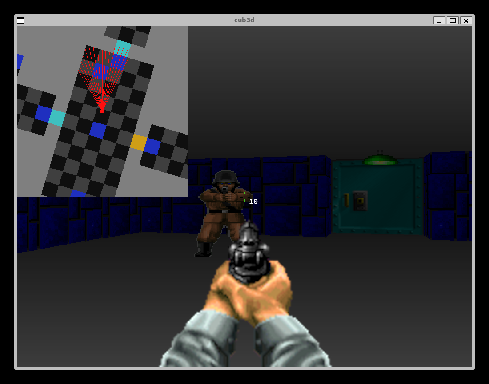

# Ray-casting Project
This project aims to implement ray-casting algorithm that was used in the first first-person shooter game Wolfenstein 3D, and use it to make our own FPS game.

It is developed using C, UNIX system calls and MLX42 graphics library. Compilable in macOS and Linux.

## What is ray-casting
Ray-casting draws pseudo 3D image using 2D input. It decides image to be drawn based on interaction between **ray**s and 2 dimensional map.
Rays start from the position of playser (i.e. camera) and disperse through circular sector shaped 2D space. If a ray detects an obstacle on the map, it stops, distance between the camera and the obstacle and color of the obstacle are obtained. 

Without considering the distance, we can draw a line consists of two colors.
```
 ------------------------------------------------
|                                                |
|                                                |
|                                                |
|                                                |
|                                                |
|aaaaaaaaaaaaa||||||||aaaaaaaa       |||||||||||||
|                                                |
|                                                |
|                                                |
|                                                |
|                                                |
 ------------------------------------------------
|: left side of the wall
a: right side of the wall
```

Use distance to decide how long the colored vertical line should be, then
```
 ------------------------------------------------
|a                                               |
|aaaaa                                       |||||
|aaaaaaaaa        ||||aaaa               |||||||||
|aaaaaaaaaaaaa||||||||aaaaaaaa       |||||||||||||
|aaaaaaaaaaaaa||||||||aaaaaaaa       |||||||||||||
|aaaaaaaaaaaaa||||||||aaaaaaaa       |||||||||||||
|aaaaaaaaaaaaa||||||||aaaaaaaa       |||||||||||||
|aaaaaaaaaaaaa||||||||aaaaaaaa       |||||||||||||
|aaaaaaaaaaaaa||||||||aaaaaaaa       |||||||||||||
|aaaaaaaaa        ||||aaaa               |||||||||
|aaaaa                                       |||||
|a                                               |
 ------------------------------------------------
```

Unlike ray-tracing where 2 dimensional rays are used and complexity is O(H*W) at least, ray-tracing can draw simple 3d image in linear complexity.


## Configuration & Map
```
NO ./images/wall1.png
SO ./images/wall2.png
WE ./images/wall3.png
EA ./images/wall4.png
DO ./images/door.png

F 29,206,195
C 64,64,64

1111111111111
1N00000110001
1000110000001
1110000000001
1111111111111
```
#### Wall
- `(NO|SO|WE|EA|DO) PATH`
There are NO(north), SO(south), WE(west), EA(east), DO(door) types for the wall. Image file path must be given.

#### Background
- `(F|C) R,G,B`
Decide colors for the floor and ceiling.

#### Map definition
- `0`: empty space
- `1`: wall
- `3`: door
- `N|S|W|E`: starting position and direction of the camera.
